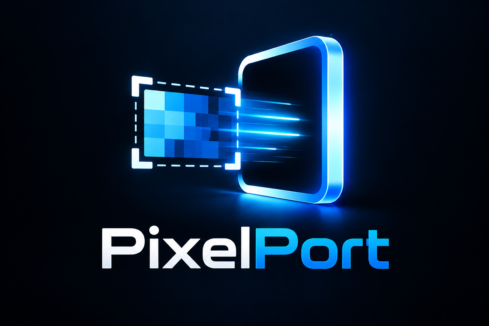

# PixelPort

<p align="center"></p>

**Hold your mouse wheel, drag a region, release — screenshot in ChatGPT, unsent.**

PixelPort v0.1.0 is a physically tested Windows 11 utility for Google Chrome and
chatgpt.com. No Python installation, OpenAI API key, or PowerShell launch is needed.

## Download and run

The Windows x64 release package is **PixelPort-v0.1.0-windows-x64.zip**.
Find published downloads on [GitHub Releases](https://github.com/bslizzle8552/pixelport/releases).
Extract the ZIP and double-click **PixelPort.exe**. Keep its console open or minimized;
startup takes a few seconds. No installer is required. The v0.1.0 executable is unsigned.

The executable includes the PixelPort logo. To keep it on the taskbar, right-click
**PixelPort.exe**, choose **Show more options** if needed, and **Pin to taskbar**.
Keep the extracted executable at that location so the shortcut continues to work.

1. Select your intended ChatGPT tab in Chrome and click its composer.
2. Wait for the console to confirm `Chrome target verified as chatgpt.com`. No G binding is needed.
3. Switch to what you want to capture. Hold the middle mouse button, drag a region, and release.
4. Check the attachment in ChatGPT, add context, and send it yourself.

PixelPort **never presses Enter or clicks Send**. Automatic paste uses **Ctrl+V only**.
Keep the intended ChatGPT tab selected in its window; PixelPort does not switch tabs
or locate the composer. Select at least 6 × 6 physical pixels.

## Controls

| Control | Action |
|---|---|
| Hold middle → drag → release | Capture a region |
| Escape | Cancel; release the wheel before trying again |
| Ctrl+Alt+Shift+S | Keyboard fallback: release keys, then left-drag |
| Ctrl+Alt+Shift+Q | Quit and restore normal middle-click behavior |
| Ctrl+Alt+Shift+G | Advanced manual target override |

PixelPort owns middle-click while running. Wheel scrolling and ordinary left/right
clicks remain available. Only one instance runs per session. Ctrl+C in the console
also quits. A duplicate launch refuses startup; dismiss its message with Enter.

## Targeting and privacy

Automatic paste requires fresh positive **chatgpt.com** verification. If verification
fails, the screenshot stays on the clipboard for manual paste. Returning to ChatGPT
restores automatic targeting after verification. A cancelled selection makes no capture.

The advanced G override bypasses automatic site verification; bind only an intended
destination and restart to clear it. Other browsers are not validated v0.1.0 support.

PixelPort runs locally with no telemetry, API calls, automatic updates, or screenshot
history. Captures replace the Windows clipboard. Other clipboard managers may retain
images. ChatGPT may upload/process pasted attachments before you send the message.
Optional diagnostics are local and off by default; review them before sharing.

## Troubleshooting

- **No automatic paste:** select ChatGPT in Chrome, focus its composer, wait for
  verification, and retry. Use manual paste when the console reports clipboard fallback.
- **Gesture unavailable:** try Ctrl+Alt+Shift+S, then quit and relaunch. Mouse remappers
  and conflicting global shortcuts can interfere.
- **Selection cancels:** keep the overlay foreground and avoid changing display layout.

Windows 11 / Chrome is the supported combination. Elevated applications, secure/UAC
screens, remote sessions and every possible display/DPI arrangement are not guaranteed.
See [validation](docs/validation.md) and [diagnostics](docs/diagnostics.md).

## Development

Use standard x64 CPython 3.14.3 with Tcl/Tk:

```powershell
python -m venv .venv
.\.venv\Scripts\python.exe -m pip install -r requirements.txt
.\.venv\Scripts\python.exe -m gptsnip
```

The internal package remains `gptsnip`. Build-only dependencies are pinned separately
in requirements-build.txt. See [ONEFILE build details](docs/onefile.md),
[architecture](docs/architecture.md), and [v0.1.0 release record](docs/release-v0.1.0.md).

## License

[MIT](LICENSE). Dependency notices accompany the release.
PixelPort is independent and is not affiliated with or endorsed by OpenAI.
